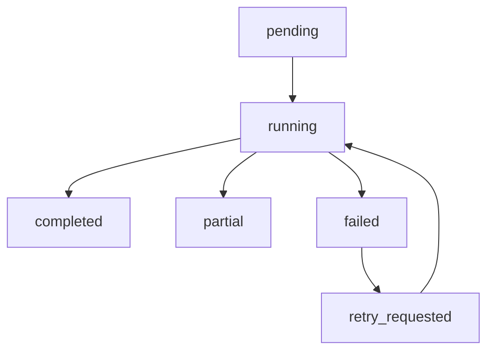

# 搜索 API 与任务生命周期规划

## 1. 目标

基于现有 [`app/main.py`](../app/main.py) 的审核 API，新增一组面向“平台关键词搜索、实时抓取、跨平台比价”的任务式 API。

目标要求：

- 不破坏现有 [`/api/candidates`](../app/main.py:108) 与 [`/api/summary`](../app/main.py:113) 等接口
- 支持前端发起搜索任务，而不是页面直接同步卡住等待抓取
- 支持查看任务状态、抓取统计、原始命中、比价结果
- 为后续 AI 建议接口预留扩展位

---

## 2. 为什么采用任务式 API

当前真实抓取链路已经暴露出超时与回退问题，例如 [`scraper.fetchers.JinaPageFetcher.fetch_text()`](../scraper/fetchers.py:104) 可能触发超时。

如果直接把“页面点击搜索”设计成一个同步长请求，会有几个问题：

1. 前端等待时间不可控
2. 超时后页面体验差
3. 抓取进度、回退、错误分类无法逐步展示
4. 后续不利于扩展缓存、历史记录和重试

因此建议：

- 第一版在 API 语义上采用任务式
- 存储实现上可先用“进程内内存存储”
- 未来再升级到 SQLite 或任务队列

---

## 3. API 分层

建议在 [`app/main.py`](../app/main.py) 中保留两组接口：

### 3.1 既有审核域 API

保留现有接口：

- [`GET /health`](../app/main.py:103)
- [`GET /api/candidates`](../app/main.py:108)
- [`GET /api/summary`](../app/main.py:113)
- [`GET /api/platforms`](../app/main.py:118)
- [`POST /api/candidates/{product_id}/decision`](../app/main.py:123)

### 3.2 新增搜索比价域 API

建议新增：

- `POST /api/search`
- `GET /api/search/{search_id}`
- `GET /api/search/{search_id}/hits`
- `GET /api/search/{search_id}/comparisons`
- `GET /api/search/{search_id}/insights`
- `POST /api/search/{search_id}/promote`
- `GET /api/search-history`

---

## 4. 接口设计细化

## 4.1 [`POST /api/search`](../app/main.py)

### 作用
创建一个新的搜索任务。

### 请求体
建议使用 [`SearchRequest`](./realtime-search-domain-plan.md) 对应结构：

```json
{
  "query": "宿舍夜灯",
  "platforms": ["xianyu", "pinduoduo"],
  "limit_per_platform": 10,
  "backend": "auto",
  "include_sample_fallback": true,
  "price_min": 10,
  "price_max": 80,
  "sort_by": "sales_signal"
}
```

### 响应体
```json
{
  "status": "accepted",
  "search_id": "search_20260409_xxx",
  "task": {
    "status": "pending"
  }
}
```

### 行为建议
- 第一版创建任务后立即执行
- 若实现简单同步执行，也仍然返回任务对象
- 不在此接口直接返回完整抓取结果，避免响应过大

---

## 4.2 [`GET /api/search/{search_id}`](../app/main.py)

### 作用
获取任务总状态。

### 返回内容
- 搜索参数
- 当前状态
- 开始/结束时间
- 错误信息
- 抓取摘要 [`SearchSummary`](./realtime-search-domain-plan.md)

### 示例响应
```json
{
  "search_id": "search_001",
  "status": "completed",
  "request": {
    "query": "宿舍夜灯",
    "platforms": ["xianyu", "pinduoduo"],
    "limit_per_platform": 10,
    "backend": "auto"
  },
  "summary": {
    "total_hits": 12,
    "real_hits": 8,
    "sample_hits": 4,
    "backend_counts": {
      "text": 8,
      "sample": 4
    },
    "error_category_counts": {
      "timeout": 1,
      "none": 11
    }
  },
  "started_at": "2026-04-09T07:40:00Z",
  "finished_at": "2026-04-09T07:40:03Z",
  "error_message": null
}
```

---

## 4.3 [`GET /api/search/{search_id}/hits`](../app/main.py)

### 作用
返回标准化抓取命中列表。

### 查询参数建议
- `platform`
- `data_source`
- `min_price`
- `max_price`
- `keyword`
- `sort_by`
- `page`
- `page_size`

### 返回内容
- `items: SearchHit[]`
- `total`
- `page`
- `page_size`

### 目的
- 给前端原始结果表使用
- 支持查看商家、营销语、图片、链接

---

## 4.4 [`GET /api/search/{search_id}/comparisons`](../app/main.py)

### 作用
返回同款归并后的跨平台比价结果。

### 查询参数建议
- `min_gap`
- `platform`
- `min_sales_signal`
- `sort_by=gap|gap_ratio|price|sales_signal`
- `only_cross_platform=true|false`

### 返回内容
- `items: ComparisonGroup[]`
- `summary: ComparisonSummary`

### 页面用途
- 比价结果主表
- 支持最高价/最低价/价差/销量信号排序

---

## 4.5 [`GET /api/search/{search_id}/insights`](../app/main.py)

### 作用
返回 AI 建议。

### 说明
- 第一阶段可以先返回空数组或占位结构
- 第二阶段接入 [`ComparisonInsight`](./realtime-search-domain-plan.md)
- AI 优先级后置，但 API 路由先预留更稳定

### 返回内容
```json
{
  "items": []
}
```

---

## 4.6 [`POST /api/search/{search_id}/promote`](../app/main.py)

### 作用
将某个比价组选中的报价转入候选审核池。

### 请求体建议
```json
{
  "group_id": "group_xxx",
  "sell_offer_id": "hit_sell_xxx",
  "source_offer_id": "hit_source_xxx"
}
```

### 返回内容
- `status`
- `candidate_draft_id`
- 后续可返回对应 [`CandidateBundle`](../app/schemas.py:148) 标识

### 用途
把搜索工作台和审核工作台打通。

---

## 4.7 [`GET /api/search-history`](../app/main.py)

### 作用
获取最近搜索记录。

### 返回内容
- 最近 N 条 [`SearchSession`](./realtime-search-domain-plan.md) 摘要
- 支持页面回看历史任务

### 第一版实现建议
- 只保留最近 20 条内存数据
- 后续再持久化到 SQLite

---

## 5. 搜索任务生命周期

建议定义如下生命周期：



### 5.1 状态说明

#### `pending`
- 任务已创建
- 尚未开始抓取

#### `running`
- 正在抓取至少一个平台
- 前端可轮询状态

#### `completed`
- 所有目标平台已完成
- 有抓取结果并完成归并

#### `partial`
- 只有部分平台完成
- 或存在部分平台使用 sample fallback
- 适合保留可用结果，同时暴露风险

#### `failed`
- 无法得到有效结果
- 或关键阶段全部失败

#### `retry_requested`
- 用户主动重试
- 可复用原请求参数

---

## 6. 第一版任务执行策略

## 6.1 推荐方案

第一版不引入 Celery 或 APScheduler，直接在应用进程内实现一个轻量任务仓库，例如：

- `SearchTaskStore`
- `SearchTaskService`

职责：
- 创建任务
- 记录状态
- 缓存结果
- 查询历史
- 清理过期任务

### 优点
- 快速落地
- 修改面小
- 便于接入现有 [`FastAPI`](../app/main.py:16)

### 限制
- 服务重启后任务丢失
- 不适合多进程部署

这对第一版工作台是可接受的。

---

## 6.2 第二版升级方向

后续可升级到：

1. SQLite 持久化任务元数据
2. 文件系统缓存 `data/search_runs/`
3. 后台线程池或队列执行
4. 最终再引入专业任务队列

---

## 7. 失败与降级策略

### 7.1 平台级失败不应直接终止整个任务

建议：
- 单平台失败时，将该平台记入 `error_category_counts`
- 任务整体标记为 `partial`
- 其余平台结果继续返回

### 7.2 sample fallback 应视为成功但带风险

建议：
- 若有 sample fallback，不记为 `failed`
- 在 [`SearchSummary`](./realtime-search-domain-plan.md) 中增加：
  - `sample_hits`
  - `fallback_count`
- 页面显式标注结果可信度降低

### 7.3 AI 建议应晚于比价结果

建议：
- 即使 AI 建议失败，也不应影响 `/comparisons`
- 任务状态最多为 `partial`，而不是整体 `failed`

---

## 8. 与现有 [`app/main.py`](../app/main.py) 的结构融合建议

建议在 [`app/main.py`](../app/main.py) 内部按职责拆函数，而不是把所有逻辑写进路由：

- `create_search_task()`
- `get_search_task()`
- `list_search_hits()`
- `list_search_comparisons()`
- `list_search_insights()`
- `promote_search_group()`

如果后续代码变多，再抽到：

- `app/search_service.py`
- `app/search_store.py`
- `app/comparison_service.py`

---

## 9. 第一阶段最小可实施 API 范围

若先实现 [`T009`](../docs/AI_SHARED_TASKLIST.md)，建议只做这 3 个：

1. `POST /api/search`
2. `GET /api/search/{search_id}`
3. `GET /api/search/{search_id}/hits`

原因：
- 先解决“页面可以输入平台关键词并触发抓取”
- 先能展示抓取结果、来源、后端、错误分类
- 比价和 AI 放在下一阶段接入

---

## 10. 实现检查清单

- [ ] 在 [`app/schemas.py`](../app/schemas.py) 补齐 `SearchRequest`、`SearchSession`、`SearchHit`、`SearchSummary`
- [ ] 在 `app` 层定义轻量任务仓库
- [ ] 在 [`app/main.py`](../app/main.py) 新增 `POST /api/search`
- [ ] 在 [`app/main.py`](../app/main.py) 新增 `GET /api/search/{search_id}`
- [ ] 在 [`app/main.py`](../app/main.py) 新增 `GET /api/search/{search_id}/hits`
- [ ] 统一任务状态枚举和值
- [ ] 统一错误与回退摘要结构
- [ ] 为新增搜索 API 编写测试

---

## 11. 下一步建议

下一步建议继续细化 [`dashboard.py`](../dashboard.py) 的页面交互流，使前端布局和上述 API 一一对应，然后再切换到实现模式。
