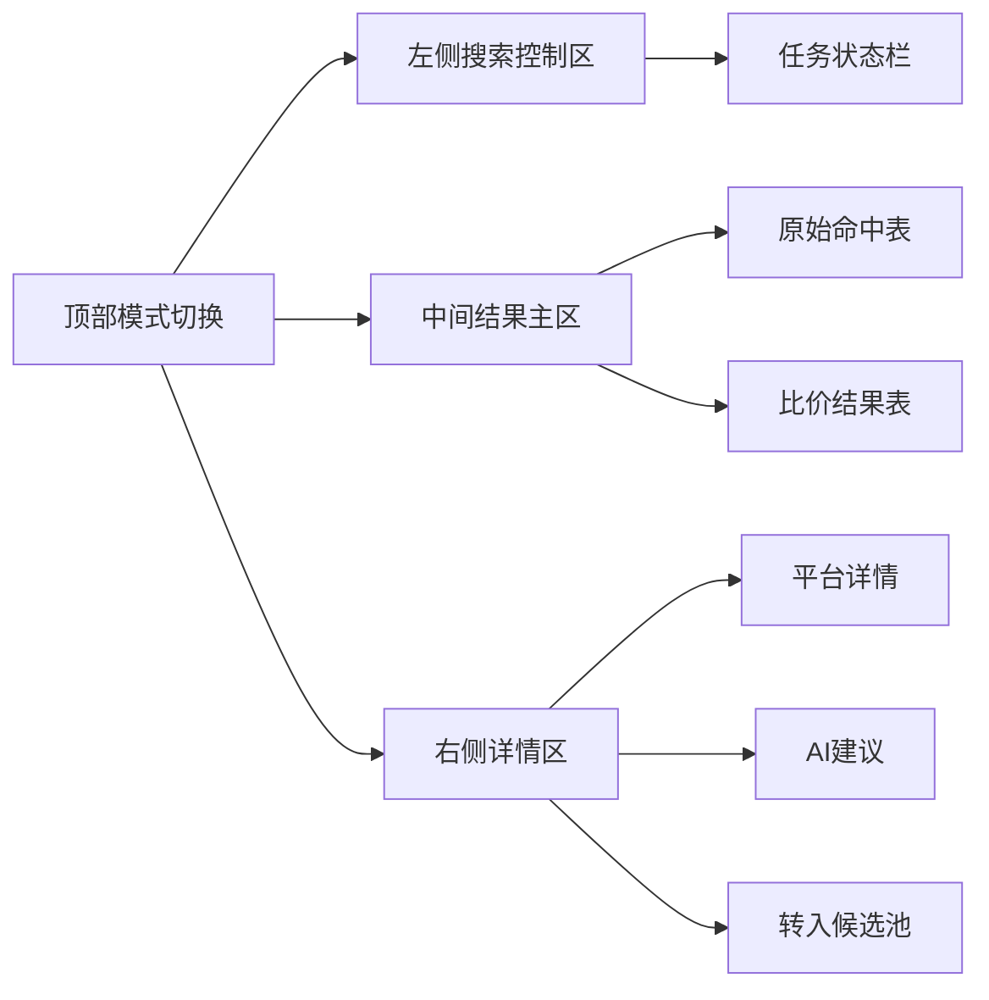

# Dashboard 搜索工作台交互规划

## 1. 目标

把当前以 [`CandidateBundle`](../app/schemas.py:148) 为中心的审核页 [`dashboard.py`](../dashboard.py) 从“静态候选审核”升级为“搜索驱动工作台”，但保持与现有审核链路兼容。

核心要求：

- 用户可以输入平台搜索关键词并发起抓取
- 页面可以看到抓取状态、来源、回退、错误分类
- 页面可以浏览原始命中结果与后续比价结果
- 后续可把结果转入现有审核池
- AI 建议区域预留，但不抢第一阶段优先级

---

## 2. 页面定位调整

当前 [`dashboard.py`](../dashboard.py:180) 的定位是：
- 读取已有候选数据
- 提供筛选
- 人工记录审批结论

调整后建议采用双模式布局：

1. 搜索工作台模式
   - 面向实时搜索、抓取、比价
2. 候选审核模式
   - 保留现有候选卡片与决策功能

### 设计原因

- 现有审核能力不能丢
- 搜索比价工作流与审核工作流不是同一个阶段
- 双模式能避免一次性完全推翻 [`dashboard.py`](../dashboard.py)

---

## 3. 顶层布局

建议采用：

---

## 4. 页面区块设计

## 4.1 顶部模式切换区

建议新增：

- `st.segmented_control` 或 `st.radio`
- 两个模式：
  - `搜索工作台`
  - `候选审核`

### 行为

- 默认进入 `搜索工作台`
- 若用户切换到 `候选审核`，继续展示当前 [`render_candidate_card()`](../dashboard.py:106) 逻辑

---

## 4.2 左侧搜索控制区

建议放在 sidebar，但搜索表单比当前筛选区更靠前。

### 控件

1. 搜索关键词输入
- 组件：`st.text_input`
- 标签：`平台搜索关键词`
- 占位：`例如 收纳 / 宿舍灯 / 蓝牙耳机`

2. 平台多选
- 组件：`st.multiselect`
- 默认：[`xianyu`, `pinduoduo`]

3. 每平台抓取数量
- 组件：`st.slider` 或 `st.number_input`
- 默认：5 或 10

4. 后端选择
- 组件：`st.selectbox`
- 选项：`auto` / `browser` / `proxy` / `text`

5. 是否允许样本回退
- 组件：`st.checkbox`
- 默认：开启

6. 价格过滤
- `最低价`
- `最高价`

7. 搜索按钮
- 组件：`st.button`
- 文案：`开始抓取`

8. 最近搜索记录
- 展示最近任务列表
- 点击可恢复结果视图

### 交互规则

- 点击 `开始抓取` 后调用 `POST /api/search`
- 返回 `search_id` 后写入 [`st.session_state`](../dashboard.py)
- 进入轮询状态

---

## 4.3 顶部任务状态栏

建议放在主区最上方，位于结果表之前。

### 展示内容

- 当前任务状态
- 搜索关键词
- 搜索平台
- 总命中数
- `real` 数量
- `sample` 数量
- `fallback_count`
- 各后端命中情况
- 错误分类摘要
- 开始时间 / 完成时间

### 组件建议

- 使用 `st.columns(5)` 或 `st.metric`
- 用 `st.info` / `st.warning` 展示 partial 和 failed

### 状态映射建议

- `pending` -> 灰色提示
- `running` -> 蓝色提示 + 自动刷新
- `completed` -> 绿色提示
- `partial` -> 黄色警告
- `failed` -> 红色错误

---

## 4.4 中部结果区

建议拆为两个 tab：

- `原始命中`
- `跨平台比价`

第一阶段先做 `原始命中`，第二阶段再加强 `跨平台比价`。

### Tab 1: 原始命中

字段建议：

- 平台
- 标题
- 价格
- 销量信号
- 商家
- 数据来源
- 后端
- 错误分类
- 链接
- 选择按钮

### 组件

- `st.dataframe` 或 `st.data_editor`
- 当前行点击后，记录 `selected_hit_id`

### 行为

- 支持筛选：平台 / 来源 / 价格区间 / 关键词
- 支持排序：价格 / 销量信号 / 平台

### Tab 2: 跨平台比价

字段建议：

- 商品组标题
- 最高平台
- 最高价
- 最低平台
- 最低价
- 差价
- 差价率
- 最大销量信号
- 推荐售卖平台
- 推荐货源平台
- 查看详情

### 行为

- 当前阶段先预留布局
- T010 实现后再完整启用

---

## 4.5 右侧详情区

### 若选中原始命中 `SearchHit`

展示：

- 标题
- 平台
- 价格
- 商家
- 营销语
- 图片
- 链接
- 来源详情
- 抓取错误分类

### 若选中比价组 `ComparisonGroup`

展示：

- 最高价平台卡片
- 最低价平台卡片
- 价格差分析
- 多平台报价列表
- 商家信息与营销语
- 图片预览

### AI 区域

先预留以下块：

- 建议售价区间
- 营销语方向
- 图片建议
- 风险提示

第一阶段可显示：
- `AI 建议尚未启用，排在比价之后`

---

## 4.6 转入候选池区

位于详情区底部。

### 第一阶段

- 仅显示禁用按钮或占位提示
- 文案：`转入候选池 即将开放`

### 第二阶段后

- 用户选择 sell/source offer
- 调用 `POST /api/search/{search_id}/promote`
- 成功后提示已进入 [`CandidateBundle`](../app/schemas.py:148) 审核池

---

## 5. 状态同步方案

## 5.1 `st.session_state` 关键键设计

建议新增：

- `workbench_mode`
- `active_search_id`
- `search_form_query`
- `search_form_platforms`
- `search_form_limit`
- `search_form_backend`
- `search_form_include_sample`
- `selected_hit_id`
- `selected_group_id`
- `search_history_cache`

---

## 5.2 页面请求节奏

### 创建任务时

1. 用户点击 `开始抓取`
2. 调用 `POST /api/search`
3. 保存 `active_search_id`
4. 立即刷新页面

### 查询状态时

- 若任务为 `pending` 或 `running`
- 周期性调用 `GET /api/search/{search_id}`
- 更新状态栏

### 查询命中结果时

- 当状态为 `completed` 或 `partial`
- 调用 `GET /api/search/{search_id}/hits`
- 刷新结果表

### 查询比价结果时

- T010 后调用 `GET /api/search/{search_id}/comparisons`

---

## 5.3 自动刷新策略

建议：

- 仅在 `running` 时自动刷新
- 每 2 到 3 秒刷新一次
- 完成后停止刷新

原因：
- 降低 Streamlit 重绘负担
- 保持体验可接受

---

## 6. 与现有审核模式兼容方案

## 6.1 候选审核模式保留

当前以下逻辑尽量不动：

- [`_get_candidates()`](../dashboard.py:26)
- [`_filter_candidates()`](../dashboard.py:71)
- [`render_candidate_card()`](../dashboard.py:106)
- [`_save_decision()`](../dashboard.py:44)

### 调整方式

将现有 [`main()`](../dashboard.py:180) 拆为：

- `render_search_workbench()`
- `render_candidate_review()`
- `render_sidebar_search_controls()`
- `render_search_status()`
- `render_hits_table()`
- `render_comparison_table()`
- `render_selection_detail()`

这样结构更清晰，也方便逐步迁移。

---

## 6.2 页面默认行为建议

默认打开 `搜索工作台`，原因：
- 更符合你期望的“我输入关键词、发起抓取、看比价结果”心智模型
- 审核模式保留为第二入口

---

## 7. 第一阶段 `T009` 对应的最小界面范围

只落地以下内容：

### 必做

- 模式切换
- 搜索关键词输入
- 平台多选
- 数量选择
- 后端选择
- 发起抓取按钮
- 任务状态栏
- 原始命中结果表
- 右侧命中详情

### 暂缓

- 比价结果表完整逻辑
- AI 建议
- 转入候选池
- 历史任务持久化

这样能最快把“当前页面为什么像死的”这个问题先解决。

---

## 8. 页面验收标准

### T009 验收

- [ ] 用户可输入平台搜索关键词
- [ ] 用户可选择平台与抓取后端
- [ ] 点击后页面能发起搜索任务
- [ ] 页面能显示 `pending/running/completed/partial/failed`
- [ ] 页面能显示抓取摘要与来源统计
- [ ] 页面能查看每条命中的价格、商家、来源、后端、链接
- [ ] 真实抓取失败但 sample fallback 时，页面能显式提示

### T010 验收

- [ ] 页面可展示最高价/最低价/差价/差价率
- [ ] 页面可查看多平台同款明细
- [ ] 页面可按价差和销量信号排序

### T012 验收

- [ ] 页面可展示建议售价区间
- [ ] 页面可展示营销语与图片建议
- [ ] 页面可展示风险提示和理由

---

## 9. 实现检查清单

- [ ] 将 [`dashboard.py`](../dashboard.py:180) 拆成搜索模式和审核模式
- [ ] 新增搜索表单组件
- [ ] 新增任务状态栏组件
- [ ] 新增命中结果表组件
- [ ] 新增详情面板组件
- [ ] 统一 `st.session_state` 键管理
- [ ] 对接 [`POST /api/search`](../app/main.py:108) 等新 API
- [ ] 为页面交互补充测试或最小验证脚本

---

## 10. 下一步建议

下一步应该收口为分阶段实施清单，然后申请切换到 [`code`](../dashboard.py) 模式，优先实现 [`T009`](../docs/AI_SHARED_TASKLIST.md) 的最小闭环。