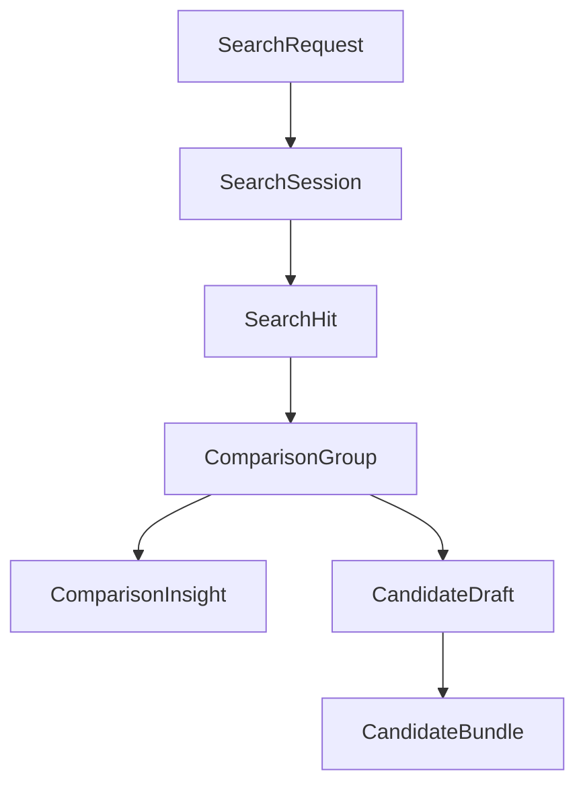

# 实时抓取与跨平台比价领域模型规划

## 1. 目标

在保留现有 [`CandidateBundle`](../app/schemas.py) 审核链路的前提下，新增一套面向搜索工作台的领域模型，使系统能够支持：

- 平台关键词搜索
- 实时抓取结果标准化
- 同款归并与跨平台比价
- 基于比价组的 AI 建议输出
- 将优质比价结果转入候选审核池

## 2. 设计原则

1. 最小侵入：不破坏现有 [`RawProduct`](../app/schemas.py)、[`AnalyzedProduct`](../app/schemas.py)、[`CandidateBundle`](../app/schemas.py) 的 MVP 审核链路。
2. 域隔离：新增搜索比价域，与现有候选审核域并行。
3. 可追踪：所有抓取、归并、AI 推导都保留来源、版本和时间戳。
4. 可降级：真实抓取失败时，结果层仍可携带样本回退与错误分类信息。
5. 可演进：第一期先用规则归并和规则 AI，后续再替换为更强识别能力。

## 3. 新增模型分层



### 3.1 请求层

#### [`SearchRequest`](../app/schemas.py)
表示一次用户发起的搜索意图。

建议字段：

- `query: str`
- `platforms: list[str]`
- `limit_per_platform: int`
- `backend: str`
- `include_sample_fallback: bool = True`
- `price_min: float | None = None`
- `price_max: float | None = None`
- `sort_by: str | None = None`
- `requested_by: str = "dashboard-user"`

说明：
- `query` 就是平台搜索关键词，如 收纳、夜灯、蓝牙耳机。
- `platforms` 支持多平台并行抓取。
- `backend` 复用现有 [`FetchBackend`](../scraper/fetchers.py) 语义。

#### [`SearchSession`](../app/schemas.py)
表示一次搜索任务实例。

建议字段：

- `search_id: str`
- `request: SearchRequest`
- `status: str`
- `started_at: datetime`
- `finished_at: datetime | None = None`
- `summary: SearchSummary | None = None`
- `error_message: str | None = None`

状态建议：
- `pending`
- `running`
- `completed`
- `failed`
- `partial`

### 3.2 抓取结果层

#### [`SearchHit`](../app/schemas.py)
表示平台返回的一条标准化商品结果。建议继承 [`RawProduct`](../app/schemas.py)。

新增字段：

- `search_id: str`
- `query: str`
- `platform_item_id: str | None = None`
- `url: str | None = None`
- `shop_id: str | None = None`
- `shop_name: str | None = None`
- `shop_tags: list[str] = []`
- `marketing_text: str | None = None`
- `image_urls: list[str] = []`
- `currency: str = "CNY"`
- `sales_label: str | None = None`
- `raw_payload: dict[str, str | int | float | bool | None] = {}`
- `normalized_title: str | None = None`
- `dedupe_key: str | None = None`

说明：
- 现有 [`RawProduct`](../app/schemas.py) 偏向分析输入。
- [`SearchHit`](../app/schemas.py) 增加链接、商家、营销语、图片等工作台展示字段。
- `raw_payload` 用于保留平台原始片段，方便调试和回放。

#### [`SearchSummary`](../app/schemas.py)
表示一次搜索任务的抓取统计结果。

建议字段：

- `search_id: str`
- `requested_platforms: list[str]`
- `completed_platforms: list[str]`
- `total_hits: int`
- `real_hits: int`
- `sample_hits: int`
- `backend_counts: dict[str, int]`
- `platform_counts: dict[str, int]`
- `error_category_counts: dict[str, int]`
- `fallback_count: int`
- `duration_ms: int | None = None`

这部分可复用 [`summarize_products()`](../scraper/__main__.py:81) 的思路，但要升级为结构化 schema。

### 3.3 比价聚合层

#### [`ComparisonOffer`](../app/schemas.py)
表示一个比价组里的单个平台报价。

建议字段：

- `search_hit_id: str`
- `platform: str`
- `title: str`
- `price: float`
- `url: str | None`
- `shop_name: str | None`
- `marketing_text: str | None`
- `image_url: str | None`
- `sales_count: int | None`
- `want_count: int | None`
- `data_source: str`
- `backend_used: str | None`

#### [`ComparisonGroup`](../app/schemas.py)
表示一组疑似同款商品的跨平台聚合结果。

建议字段：

- `group_id: str`
- `search_id: str`
- `query: str`
- `normalized_title: str`
- `category_label: str | None = None`
- `offers: list[ComparisonOffer]`
- `highest_offer: ComparisonOffer | None = None`
- `lowest_offer: ComparisonOffer | None = None`
- `price_gap: float = 0`
- `price_gap_ratio: float = 0`
- `platforms: list[str]`
- `offer_count: int`
- `max_sales_signal: int | None = None`
- `min_sales_signal: int | None = None`
- `comparison_version: str = "comparison-rule-v1"`
- `generated_at: datetime`

#### [`ComparisonSummary`](../app/schemas.py)
表示本次搜索的比价概览。

建议字段：

- `search_id: str`
- `group_count: int`
- `cross_platform_group_count: int`
- `largest_gap_group_id: str | None = None`
- `largest_gap_value: float | None = None`
- `recommended_sell_platforms: dict[str, int]`
- `recommended_source_platforms: dict[str, int]`

### 3.4 AI 建议层

#### [`ComparisonInsight`](../app/schemas.py)
面向一个比价组的 AI 建议输出。

建议字段：

- `group_id: str`
- `search_id: str`
- `recommended_sell_platform: str | None = None`
- `recommended_source_platform: str | None = None`
- `suggested_price_min: float | None = None`
- `suggested_price_max: float | None = None`
- `estimated_margin: float | None = None`
- `headline_suggestions: list[str] = []`
- `marketing_angles: list[str] = []`
- `image_suggestions: list[str] = []`
- `risk_flags: list[str] = []`
- `reasoning: list[str] = []`
- `confidence_score: float | None = None`
- `insight_version: str = "comparison-ai-v1"`
- `generated_at: datetime`

说明：
- 第一版可以由规则生成。
- 后续再复用或扩展 [`AIAssetBuilder`](../app/ai.py:21) 做 richer output。

### 3.5 审核接入层

#### [`CandidateDraft`](../app/schemas.py)
表示从比价结果转入审核池之前的中间结构。

建议字段：

- `group_id: str`
- `selected_offer: ComparisonOffer`
- `source_offer: ComparisonOffer | None = None`
- `insight: ComparisonInsight | None = None`
- `draft_status: str = "new"`
- `created_at: datetime`

作用：
- 把搜索比价域和 [`CandidateBundle`](../app/schemas.py) 审核域解耦。
- 后续用户可选定某个平台报价作为售卖侧，再选另一个平台作为供货侧。

## 4. 领域关系

### 4.1 与现有模型关系

- [`RawProduct`](../app/schemas.py) 继续作为基础抓取标准。
- [`SearchHit`](../app/schemas.py) = `RawProduct + 搜索工作台展示字段`
- [`ComparisonGroup`](../app/schemas.py) 聚合多个 [`SearchHit`](../app/schemas.py)
- [`ComparisonInsight`](../app/schemas.py) 绑定 [`ComparisonGroup`](../app/schemas.py)
- [`CandidateDraft`](../app/schemas.py) 负责把比价结果映射到 [`CandidateBundle`](../app/schemas.py)

### 4.2 推荐映射关系

```text
SearchRequest
  -> SearchSession
  -> SearchHit[]
  -> ComparisonGroup[]
  -> ComparisonInsight[]
  -> CandidateDraft[]
  -> CandidateBundle[]
```

## 5. 数据流设计

### 5.1 搜索主流程

1. 用户在工作台输入平台关键词
2. 前端提交 [`SearchRequest`](../app/schemas.py)
3. 服务创建 [`SearchSession`](../app/schemas.py)
4. 抓取层返回多个 [`SearchHit`](../app/schemas.py)
5. 聚合层按规则归并为 [`ComparisonGroup`](../app/schemas.py)
6. AI 层为每个分组生成 [`ComparisonInsight`](../app/schemas.py)
7. 用户可把某个分组转为 [`CandidateDraft`](../app/schemas.py)
8. 再映射进入 [`CandidateBundle`](../app/schemas.py) 审核池

### 5.2 同款归并规则建议

第一版只做规则归并：

- 标题标准化：去平台噪音词、去规格噪音、统一大小写与空白
- 类目优先：只在相同类目下尝试归并
- 关键词重合度：至少达到阈值
- 价格约束：价格差过大时不归并
- 图像能力后置：第一版不做视觉相似度

### 5.3 销量信号统一建议

因为 [`RawProduct`](../app/schemas.py) 里存在 `want_count` 与 `sales_count` 双口径，建议在比价域增加统一概念：

- `sales_signal`
- 规则：
  - 拼多多优先用 `sales_count`
  - 闲鱼优先用 `want_count`
  - 同时保留原始字段，避免信息损失

## 6. 兼容性建议

### 6.1 不直接改造现有 [`RawProduct`](../app/schemas.py)

理由：
- 现有分析链路已经稳定。
- 若把搜索工作台字段全部塞进 [`RawProduct`](../app/schemas.py)，会让 Analyzer 和 Pipeline 背上不必要复杂度。

建议：
- 保持 [`RawProduct`](../app/schemas.py) 轻量。
- 新增 [`SearchHit`](../app/schemas.py) 继承扩展。

### 6.2 不直接让 [`ComparisonGroup`](../app/schemas.py) 替代 [`CandidateBundle`](../app/schemas.py)

理由：
- 审核链路和搜索链路是两个不同阶段。
- 搜索结果未必已经完成货源匹配、文案生成和审核准备。

建议：
- 通过 [`CandidateDraft`](../app/schemas.py) 做桥接。

## 7. 实现检查清单

- [ ] 在 [`app/schemas.py`](../app/schemas.py) 增加 `SearchRequest`
- [ ] 在 [`app/schemas.py`](../app/schemas.py) 增加 `SearchSession`
- [ ] 在 [`app/schemas.py`](../app/schemas.py) 增加 `SearchHit`
- [ ] 在 [`app/schemas.py`](../app/schemas.py) 增加 `SearchSummary`
- [ ] 在 [`app/schemas.py`](../app/schemas.py) 增加 `ComparisonOffer`
- [ ] 在 [`app/schemas.py`](../app/schemas.py) 增加 `ComparisonGroup`
- [ ] 在 [`app/schemas.py`](../app/schemas.py) 增加 `ComparisonSummary`
- [ ] 在 [`app/schemas.py`](../app/schemas.py) 增加 `ComparisonInsight`
- [ ] 在 [`app/schemas.py`](../app/schemas.py) 增加 `CandidateDraft`
- [ ] 明确搜索域到审核域的转换协议

## 8. 下一步建议

下一步应继续细化：

1. [`app/main.py`](../app/main.py) API 设计
2. [`dashboard.py`](../dashboard.py) 交互流设计
3. 搜索任务存储位置与生命周期
4. 第一阶段只落地 [`T009`](../docs/AI_SHARED_TASKLIST.md) 的最小实现范围
